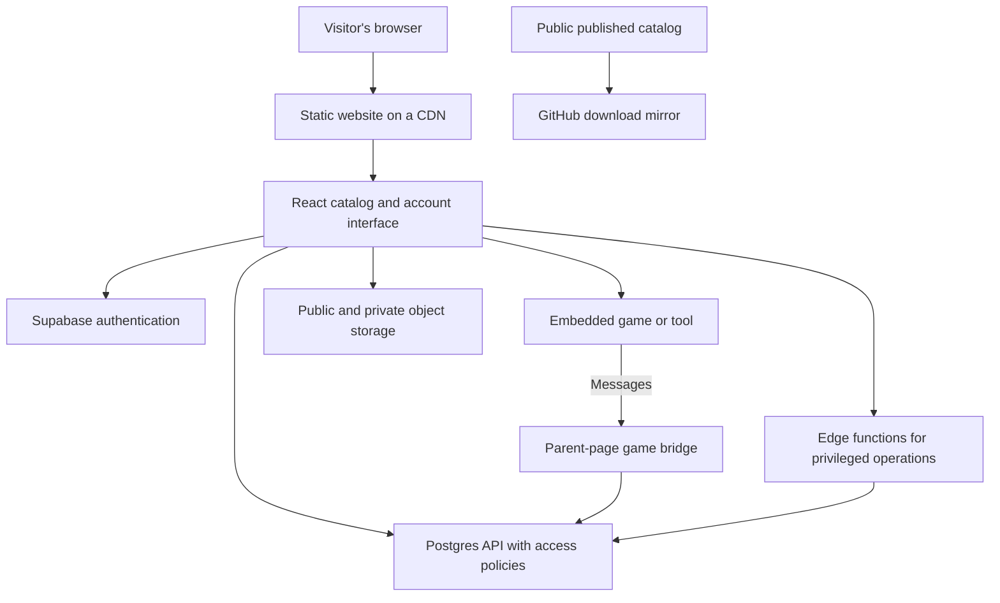

# How Batchly is made

### An architectural overview of a browser game and tool platform

**Version:** September 2026. **Project:** [Batchly](https://batch-ly.com).

## Abstract

Batchly combines a catalog of browser games, practical tools and community projects with shared accounts, saved progress, leaderboards and moderation. Its central design separates the website that discovers and manages applications from the applications themselves. A static React frontend provides the interface, a managed Postgres backend provides identity and durable data, and embedded documents run game code. This note explains those boundaries and the decisions behind them. It is an engineering overview, not a peer-reviewed research paper, a measured performance study or a complete deployment recipe.

The accompanying [public library](../catalog/README.md) exposes selected, reviewed source-only game files. The platform's private implementation, credentials, user records and operational configuration are intentionally outside that library. The architecture is useful as a starting point for an independently designed platform.

## 1. System shape

The browser loads the interface from Amazon S3 through CloudFront. React, TypeScript and Vite provide the frontend application and production build; Tailwind and reusable interface components provide styling and interaction patterns. A static frontend keeps the main delivery path simple: ordinary pages do not require a dedicated application server to render every request. See [Vite's build model](https://vite.dev/guide/build).

Supabase supplies authentication, Postgres, object storage, realtime capabilities and edge functions. These components have separate jobs. Authentication establishes identity; database policies decide which rows that identity may access; storage policies decide which files it may read; server functions handle operations that should not run with browser privileges.

## 2. Catalog versus application

The catalog holds discoverable metadata such as a title, description, category, icon, controls and play URL. Application content is a separate concern: many entries are a single HTML document containing markup, styles and JavaScript. Some have Python source, runtime dependencies or external assets; others launch a separately hosted application.

This separation lets a small application join the platform without becoming another React feature. It also means the platform must describe each application's actual requirements. A keyboard-only game should say so, and a large external build should not be presented as a tiny offline document.

The administrative catalog and community publishing system have different trust and review paths. The download mirror covers explicitly reviewed versions of selected public admin entries and published community snapshots. Licensed and unreviewed applications stay excluded. It does not treat every upload as immediately public.

## 3. Running games and sharing services

The play page embeds an application and mediates shared services through a bridge. A game can ask to load progress, report a score or save state without implementing its own account system. Message names and payloads form a small protocol between the game and its host page.

For community documents, sandboxed frames with an opaque origin provide a meaningful boundary from the parent page's session. Parent handlers must still validate message sources and payloads, and server-side permissions remain necessary. Trusted catalog applications have historically used a more permissive frame setup, so the two paths should not be described as providing identical isolation. A sandbox is one layer, not proof that arbitrary code is harmless. The [browser iframe sandbox model](https://developer.mozilla.org/en-US/docs/Web/HTML/Reference/Elements/iframe#sandbox) explains the significance of individual permissions.

Save ordering is a practical example of why a bridge needs a protocol rather than only a callback. A newly opened game might generate a default save before the host finishes loading an existing one. Batchly uses a load handshake and distinguishes saves made before and after the reply, preventing a premature empty state from replacing stored progress. Navigation also needs to associate late replies with the game that requested them.

Scores and achievements need their own validation and abuse controls. Accepting a score sent by browser JavaScript is not equivalent to verifying that gameplay occurred honestly.

## 4. Publishing and review

A community submission passes through review before publication. The published snapshot stays separate from the editable submission, so a new pending edit does not silently replace the version visitors already approved or played. Automated review can help prioritize work, but uncertain or oversized submissions can remain pending for a person.

Administrative tools support reviewing content, resolving reports and examining operational status. MCP adds a tool interface for creator uploads and separately scoped administrative tasks. Creator permission and administrative permission are distinct. Administrative access uses expiring credentials, role checks, audit records and additional confirmation for selected destructive actions.

The GitHub mirror is deliberately downstream of publication. It reads only through public access and copies only byte-for-byte versions cleared for redistribution into a fresh repository. This is simpler to audit than giving a repository automation access to the private platform database. The trade-off is a scheduled delay rather than an immediate update on every publish.

## 5. Identity and data boundaries

Interface visibility is not authorization. Hiding an admin button is useful design, but the database and server must independently refuse unauthorized actions. Batchly combines authenticated sessions with Postgres row-level security, controlled database functions and server checks. Supabase's [RLS documentation](https://supabase.com/docs/guides/database/postgres/row-level-security) describes how policies apply to browser requests.

The frontend's publishable API key identifies the public client; it is not a backend administrator password. What makes that model safe is the access policy around each exposed table, view, function and bucket. Service credentials stay server-side. A public projection should explicitly expose the intended fields rather than accidentally inheriting future private columns. See [Supabase API key roles](https://supabase.com/docs/guides/getting-started/api-keys).

Files have their own lifecycle. Deleting a database row does not inherently delete the corresponding object-storage bytes. Batchly uses account-file sweeps and cleanup queues for designated personal uploads, with retry behavior and visible failures. Shared site assets and retained administrative records need separate retention decisions.

## 6. Delivery and maintenance

A production frontend is a built snapshot, not the developer's current source folder. Batchly builds the site, uploads static files and refreshes CDN entry points. Older hashed JavaScript assets must survive long enough for already-open tabs to request them. Separately uploaded game builds must also survive a normal website deployment. A broad storage synchronization that deletes everything absent from a build folder can break both cases.

Verification therefore has several levels: type checking and focused automated tests, authorization checks at real boundaries, browser checks of important flows, and comparison of deployed files with the intended build. An HTTP success response alone cannot establish that the correct version shipped. Changes are recorded in an internal site log so later maintainers can distinguish deployed behavior from work still in progress.

## 7. Building something similar

An independent implementation can start with a much smaller slice:

1. Build a static catalog and a play page with a deliberately restricted embedded document.
2. Add authentication and a minimal database with explicit public, owner and administrator access rules.
3. Define a narrow score/save protocol, including load ordering and navigation behavior.
4. Separate editable submissions from published versions and introduce human review before opening uploads widely.
5. Give uploaded files an ownership convention, deletion process and size limits.
6. Add operational visibility, repeatable deployment and browser verification before adding more integrations.

The technology choices are interchangeable. The essential design is the separation of content from host services, public publication from private editing, and interface convenience from server-enforced authority. Those boundaries matter more than reproducing Batchly's exact appearance or infrastructure layout.

## Limitations

This document summarizes an evolving implementation. It does not include every schema, permission rule, runtime adapter or deployment dependency, and it makes no claim of formal security verification or measured scalability. Downloaded games may require their original libraries, attribution and online services. Use the public files as concrete examples, preserve their notices and design the surrounding system for your own requirements.
